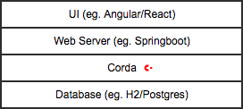

# Cordapp Architecture 
When building a Cordapp and deploying it to a decentralized network there are a number of new factors to take into consideration. Developers are no longer in control of a single centralized service, the application is independently run by another entity. 

The following sections cover the considerations that must be taken into account when architecting and designing a Cordapp.

## Simplifications
In preparation for a Cordapp Trial architecture choices are simplified because the application does not need to be production ready yet. 
- The Cordapp Trail consists of 2 weeks of deployment and 1 week of trialing the application.
- All data created will be cleared once the trial is done. Therefore there is no requirement for persisting data for an extended period of time. 
- All data is mock data. Therefore there is no requirement for security of data because no monetary value or personal information is being exchanged.
- Deployment is on a public cloud. No approvals are required to deploy on premise and no machines need to be obtained.

## Corda Open Source and Corda Enterprise
Either Corda Open Source or Corda Enterprise may be used for a Cordapp trial. Open Source Corda is currently the default version used for Cordapp Trials. Corda Enterprise can also be used if desired.

The main benefit of using Corda Enterprise in a trial at this time is the addition of multi-threading. This will improve the performance of Corda in situations where many flows are being run in parallel. However, Cordapp Trials do not require a high level of performance.

## 3-tier Architecture
Each Corda node follows a standard 3-tier architecture model. This means that the trial application is composed of more than a Cordapp: it also includes a UI and Web Services layer.

1. UI: choice of UI framework is at your discretion. Previous trials have used javascript frameworks such as React.js and AngularJS.
2. Web Services: choice of web service layer is at your discretion. Most Corda projects use Springboot. The web server should be JVM based so the Corda RPCClient can be used.
3. Corda: This is Cordapp which handles transactions, contracts, flows and recording data to the ledger.
4. Database: Typically this is H2 or Postgres for open source deployments. Production deployments of Corda use an enterprise database like SQL Server or Oracle. For a short term trial H2 is generally sufficient and is already built into Corda.

## User Interface
The UI looks no different than any standard browser based UI you are accustomed to seeing. The value of the UI is to demonstrate the value of a decentralized solution and the transaction privacy that is built into Corda.

Each trial use case covers many roles and each role should be distinguished with its own verion of the UI. Each role does not need to have a separate code base but each participant should be able to deploy a version of the UI which is specific to the role they are taking on.

When designing the UI keep in mind that the UI will be disconnected from the Corda node. It will interact directly with the web services layer over http and will be completely unaware of the fact that data is being stored on a blockchain ledger. 

## Web Services
This is a simple layer which translates RESTful http APIs calls into RPC requests for the Corda node. No business logic should be done at this layer. The http APIs will map directly to the Corda flows in a one to one ratio to allow the UI to initiate each type of transaction.

## Cordapp
The implementation of the Corda solution which maps out the data model and the actions that can be taken within the business use case. 

Best practices on how to develop the Cordapp follow [here](./cordapp_development_best_practices.md)

## Testnet
The Cordapp trial will be run on Corda Testnet which is the Corda Network sandbox. Testnet provides the network services required to operate a Corda Network including: a Doorman, a Notary and a Network Map. More information can be found here: https://docs.corda.net/head/corda-testnet-intro.html

The deployment tooling in the trial framework will help facilitate all interaction with Testnet as part of deploying a node. 

To explore testnet, you will need to register for an account here: https://testnet.corda.network/. If asked for the reason for your request, please write ‘CorDapp Trial Partner’ text box.

## Quality
The application will need to meet minimum testing requirements to ensure the success of the trial.

#### Application Testing
An inital investment into testing is imperative to ensure the trial deadlines can be met. Creating a test network can be involved and trial test steps can be onerous to perform manually. It is *strongly* recommended that the application development team build the following two test suites at a minimum.

The trial application must pass basic testing on a local machine. The first phase of testing is done with automated unit testing to reduce the risk of regression during trial application development.

The next phase of testing is integration testing of nodes which will be run locally at first before then running the same tests against Corda nodes deployed to the cloud platform of choice.

Information on example implementations can be found here:
 - For [trial applications](./cordapp_testing.md)
 - From Corda documentation: https://docs.corda.net/api-testing.html

#### End to End Testing
Isolated application testing is good for development but insufficient to ensure the Cordapp Trial will be a success. A fully deployed network adds additional complexity:
* An external notary not within control of the BNO
* Long lived services like the BNMS
* Long lived VMs for Corda nodes
* Integration of API calls from a front end UI
* Deployment by non-technical users
* Unexpected user input (aka not the "happy path")
* Many more

Plan for at least 3 weeks of end to end testing where the trial Cordapp can be tested by people both familiar and unfamiliar with the use case. If you haven't found bugs you're not testing hard enough, especially for new applications.

## Business Network Membership Service

Amongst the Corda Network each business use case can be separated into business networks. The business network provides a logical separation from the rest of the network that ensures only approved nodes can interact with one another. This is essential in a trial as each iteration of a trial will need to be a separate business network.

A detailed walkthrough of integrating the BNMS is [here](./bnms_integration.md)
 
## Deployment
Once the trial application is developed it will need to be deployed to a public cloud infrastructure platform (e.g. AWS, Azure, Google Cloud etc). On premise deployment is out of scope for Cordapp Trials.

The Trial Framework contains a deployment toolkit for Cordapp Trials. This enables the deployment of cordapps by following a standardized architecture pattern. The toolkit includes scripts which configure a VM to run all required services for the trial application.

The trial application is distributed as a series of Docker images for the UI, Web Services and Cordapp. These examples serve as a starting point for the right Docker configurations and installation scripts. The resulting images can be uploaded to a private container registry for sharing the trial images during the Cordapp Trial deployment phase.

The steps required for deployment must be documented and will be distributed to clients on how to deploy the trial application. This includes a step by step guide, screen shots, and potentially a video walkthrough.

More information can be found [here](../deployment_toolkit.md)

#### Network Testing
Deploy the trial application to Testnet and test the use case using Testnet network services. Application behavior on a network may vary from local testing and many types of tests should be run:
- Load: execute the business use case many times to load 100s or 1000s of transactions to ensure the services continue to function correctly. The quantity of transactions necessary to test will depend on the use case. The system does not need to be tested to the breaking point as a Cordapp Trial is typically lighter weight.
- Stress: execute the business use case many times in parallel as many participants may use the trial application simultaneously. The max throughput generally does not need to be high high and will depend on the use case as well as the number of trial participants.
- Performance: ensure the application is responsive to basic usage. This does not mean a high number of transactions per second but that the application is engaging.

#### Trial Summary Animation
An optional output to the trial is an animation which replays all activity from the global trial. The animation is for marketing outreach and serves as a concise summary of the entire Cordapp Trial experience.

The Cordainsure trial animation can be used as a reference: https://nextproject.co/cordainsure/overview.html

The animation is constructed from the transaction history of a single central provider within the trial. However, not all use cases have a central node involved in all transactions. In that case an additional observer would need to be added to the network or the ledgers of all involved parties would need to be combined.

To build the animation log into a central node who has seen all transactions and query the following data:

1. ssh into the Corda node's VM
2. Copy the h2 database into the VM: `sudo docker cp <cordapp_container>:/opt/corda/persistence.mv.db .`
3. Copy the h2 database to your local machine `scp r3@<node_dns>.eastus2.cloudapp.azure.com:~/persistence.mv.db .`
4. Run H2 `.../h2/bin/h2.sh` http://h2database.com
5. Log into the database:
    1. `jdbc:h2:/<location of database file>/persistence`
    2. username `sa`
    3. password is in the node.conf of the datastore (eg. Cordacorda1!)
6. `SELECT * FROM VAULT_TRANSACTION_NOTES`
7. Copy paste the results into an excel spreadsheet for sharing

